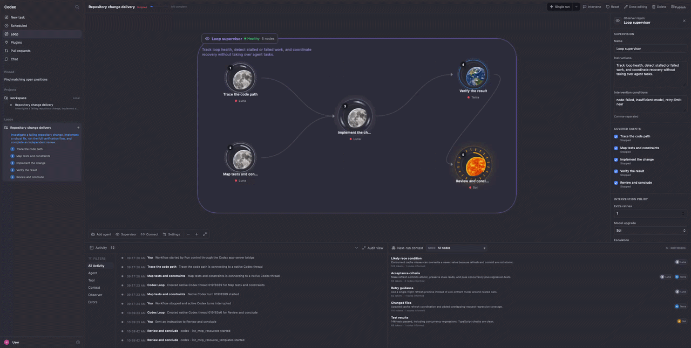

# Codex Loop

Codex Loop is a local, chat-first control plane for designing, running, and supervising reusable Codex workflows. Describe an outcome to the persistent Loop Designer; it turns the request into a validated, versioned execution graph and keeps the full graphical editor behind an explicit **Edit visually** action.



## What it provides

- Chat-first graph creation and revision through a read-only GPT-5.6 Sol Designer thread.
- A read-only graph preview plus a graphical editor for nodes, dependencies, budgets, retries, capabilities, context access, and supervisor behavior.
- Agent, map, join, condition, loop, verify, gate, and subworkflow orchestration nodes.
- Per-node Sol, Terra, or Luna selection, reasoning effort, retry upgrades, and a post-design assessment of model fit, expected token-use drivers, and current Codex credit costs.
- Live discovery of available Codex skills, apps, MCP servers, Computer Use, and supported CLI capabilities.
- Native Codex threads backed by `codex app-server`, including streamed messages, tool calls, file changes, approvals, user-input requests, token usage, and status updates.
- One-time, scheduled, and webhook-triggered runs; immutable run history; simulation; interventions; checkpoints; bounded retries; and no-progress detection.
- Durable JSON storage and Docker packaging for a local workstation or trusted home server.
- An authenticated Streamable HTTP MCP surface plus packaged `design-loop` and `operate-loop` skills for controlling Loop from another Codex task.

## How it works

The browser is an operator interface, not a Codex credential holder. The Express server owns the authenticated `codex app-server` subprocess and exposes narrow workflow and thread operations to the UI. Each graph node maps to a persisted native Codex thread. Loop owns dependency scheduling, budgets, checkpoints, capability bindings, context routing, gates, and supervision; Codex owns the reasoning and tool-use loop inside each worker.

The Designer returns schema-constrained proposals. Loop compiles each complete proposal into a new workflow revision, validates it, records the mutation, and shows assumptions or up to three consequential questions. Creating or revising a graph also produces a model-selection assessment that explains:

- whether each model and reasoning effort matches the task complexity;
- how context, reasoning effort, graph fan-out, tools, retries, and the token ceiling affect usage;
- the comparative Codex credit rates for Sol, Terra, and Luna; and
- when a cheaper or stronger model would be a better tradeoff.

Credit rates can change, so the Designer points users to the [current Codex pricing page](https://learn.chatgpt.com/docs/pricing). Actual run cost depends on the input, cached input, output, reasoning, tools, and retries consumed by that run.

## Quick start from source

Prerequisites:

- Node.js 22 and npm.
- A current Codex CLI available as `codex`.
- An authenticated local Codex session (`codex login status`).
- A repository or projects directory that workers may use as their workspace.

```bash
npm ci
codex login status
npm run dev
```

Open `http://127.0.0.1:5173`. Vite proxies API requests to `http://127.0.0.1:4317` during development.

For a production-style source run:

```bash
npm run build
npm test
npm start
```

Open `http://127.0.0.1:4317` after the build. The server serves the compiled interface and API from the same origin.

For the simplest agent-oriented local container build, follow [build.md](build.md). That guide builds and runs one local Docker image and intentionally excludes release tagging, GHCR, Watchtower, Caddy, and home-server setup.

## Designing a Loop

1. Open **Loop** and create a blank Loop or start from a template.
2. Describe the outcome in the Designer chat.
3. Review the graph, the Designer response, model/cost assessment, assumptions, setup requirements, and validation issues.
4. Refine the graph in chat, or choose **Edit visually** to change it directly.
5. Simulate the Loop for a non-persisted, read-only readiness report.
6. Save and publish a valid revision, configure its trigger, and run it.

Visual edits support node creation and deletion, connection management, drag positioning, orchestration settings, model and effort selection, retry policy, task capability autocomplete, context visibility, secrets-by-reference, run budgets, and supervisor escalation policy. Secret values do not belong in a Loop definition.

## Node kinds

| Kind | Purpose |
| --- | --- |
| `agent` | Run one bounded Codex worker task. |
| `map` | Fan out independent work over a collection within concurrency and total-agent budgets. |
| `join` | Wait for upstream branches and synthesize their results. |
| `condition` | Select supported outgoing routes from evidence. |
| `loop` | Repeat until a declared stop condition or iteration limit is reached. |
| `verify` | Independently test or challenge upstream claims against a rubric. |
| `gate` | Require explicit human approval before continuing. |
| `subworkflow` | Invoke another saved Loop as a bounded child workflow. |

## Run modes

- **Simulate** validates the dependency plan and produces a generic preview. It performs only read-only workspace and capability/authentication probes; it does not create threads, run tools, modify files, or persist a run.
- **Run once** starts a saved Loop with an optional one-time prompt and working directory. It does not overwrite the configured scheduled or webhook trigger.
- **Scheduled run** starts on selected weekdays and times in an IANA time zone. The coordinator prevents duplicate starts for the same scheduled minute.
- **Webhook run** exposes a tokenized `GET` or `POST` endpoint at `/api/triggers/:token`. Query values or a JSON object are merged with configured defaults and made available to the run.

Each run freezes its thread messages, tool calls, file changes, final outputs, checkpoints, token use, and audit events. The operator can pause, resume, stop, answer native user-input requests, resolve gates, steer active work, queue follow-ups, or inject curated context. Token ceilings and maximum no-progress rounds stop unbounded work.

## Models and token use

Loop uses the short names **Sol**, **Terra**, and **Luna** in workflow definitions:

- **Sol** is the highest-capability and highest-cost option for ambiguous, difficult, or high-value work.
- **Terra** balances reasoning quality and cost for everyday implementation and tool use.
- **Luna** is the lowest-cost option for clear, repeatable, high-volume tasks.

Reasoning effort is configured separately. Use the lowest effort that reliably satisfies the node’s definition of done; higher effort, larger context, verbose tool results, fan-out, retries, and long outputs can all increase token consumption. Loop tracks native `thread/tokenUsage/updated` events against an optional workflow token ceiling.

## Persistence and security

By default, workflow definitions, native thread mappings, mutations, run records, and execution evidence live in `data/codex-loop.json`. Keep `data/` persistent when replacing a container. The Docker setup also mounts the host Codex home and workspace instead of baking credentials or user data into the image.

Codex Loop can launch native Codex workers that read and modify the mounted workspace according to `CODEX_LOOP_SANDBOX`. It has no built-in public-user authentication for the web interface. Keep it on a trusted local machine, LAN, or private network. Do not expose it to the public internet without adding authentication and TLS, and never commit `.env`, Codex credentials, tokens, secrets, or workflow state.

## Configuration

| Variable | Default | Purpose |
| --- | --- | --- |
| `HOST` | `127.0.0.1` | API/UI bind address. The container sets `0.0.0.0`. |
| `PORT` | `4317` | API/UI port. |
| `CODEX_BINARY` | `codex` | Codex CLI executable path. |
| `CODEX_LOOP_WORKSPACE` | server working directory | Default repository or workspace for Designer inspection and worker runs. |
| `CODEX_LOOP_MODEL` | Codex default | Optional native worker model override. |
| `CODEX_LOOP_DESIGNER_MODEL` | `gpt-5.6-sol` | Persistent Designer model. |
| `CODEX_LOOP_SANDBOX` | `workspace-write` | Worker sandbox: `read-only`, `workspace-write`, or `danger-full-access`. |
| `CODEX_LOOP_PUBLIC_URL` | `http://127.0.0.1:4317` | Base URL used in generated deep links. |
| `CODEX_LOOP_MCP_TOKEN` | empty | Bearer token required by `/mcp` when configured. |
| `CODEX_LOOP_SUPERVISOR_INTERVAL_MS` | internal default | Attention-supervisor polling interval. |
| `CODEX_LOOP_STALL_THRESHOLD_MS` | internal default | Age threshold for stalled-work attention. |

Container-only path variables in `.env.example` map the host Codex home and workspace into the published Compose deployment.

## HTTP and MCP surfaces

Important health and integration routes include:

- `GET /api/health` — liveness (`{"status":"ok"}`).
- `GET /api/version` — build version, Git revision, and build timestamp.
- `GET /api/bridge/status` — native Codex bridge state.
- `GET /api/task-capabilities` — normalized live capability inventory.
- `/api/workflows/...` — workflow, revision, validation, Designer, run, simulation, thread, attention, and intervention operations.
- `GET|POST /api/triggers/:token` — published webhook triggers.
- `POST /mcp` — Streamable HTTP MCP endpoint, protected by `CODEX_LOOP_MCP_TOKEN` when set.

The repository contains `plugins/codex-loop` with two skills:

- `design-loop` creates, clarifies, revises, validates, and explicitly publishes definitions.
- `operate-loop` inspects runs and performs only explicitly requested start, pause, resume, stop, or gate actions.

Install that plugin through a local Codex plugin marketplace, configure its MCP URL, and export the same `CODEX_LOOP_MCP_TOKEN` on both sides. For the home-server deployment, use `http://codex-loop.home/mcp`.

## Local validation

Run the repository checks before committing:

```bash
npm test
npm run build
docker build -t codex-loop:local .
docker compose config
```

For deployment changes, also verify `/api/health`, `/api/version`, and `scripts/check-latest-release.sh` against the live route. A build pass alone does not prove the rendered graph and editor interactions; visually check the affected flow at desktop and mobile sizes.

## Release and home-server deployment

Every successful push to `main` is a release event. `.github/workflows/release.yml` runs tests and the production build, publishes multi-architecture `ghcr.io/mauri3112/codex-loop:latest` and immutable `v1.0.<run-number>` images, and creates the matching GitHub release.

The repository’s `docker-compose.yml` is the always-current home-server deployment, not the minimal local build path. It joins the external `home-server-proxy` network and runs a label-scoped Watchtower updater every five minutes. Runtime data, the host Codex home, and the mounted projects workspace survive image replacement.

```bash
cp .env.example .env
# Set CODEX_LOOP_MCP_TOKEN to a long random value before using MCP over the LAN.
docker compose pull
docker compose up -d
./scripts/check-latest-release.sh
```

The LAN route is `http://codex-loop.home`; version metadata is at `http://codex-loop.home/api/version`. Caddy routing, LAN DNS, the landing page, and operator documentation belong to the sibling `/Users/mauri-home/Documents/projects/home-server-setup` repository. Any route, container, network, port, or deployment-procedure change must be kept aligned there.

## Repository map

- `src/components` — chat, canvas, editor, run control, history, activity, and intervention UI.
- `src/domain` — workflow types, normalization, validation, simulation, context, and model helpers.
- `server` — Express API, persistence, Designer, Codex bridge, run coordinator, supervisor, simulation, triggers, and MCP.
- `plugins/codex-loop` — packaged Loop design and operation skills.
- `docs` — architecture, parity, attention, and intervention notes plus the README demo.
- `scripts` — bridge and release/runtime verification helpers.
- `build.md` — minimal local Docker build and run instructions for an agent.

## Additional documentation

- [Local Docker build](build.md)
- [Claude Code workflow parity](docs/claude-code-workflow-parity.md)
- [Attention and intervention](docs/attention-and-intervention.md)
- [Original product brief](codex_loop.md)

## License

Codex Loop is open-source software licensed under the [MIT License](LICENSE).
