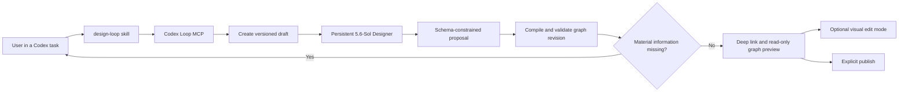
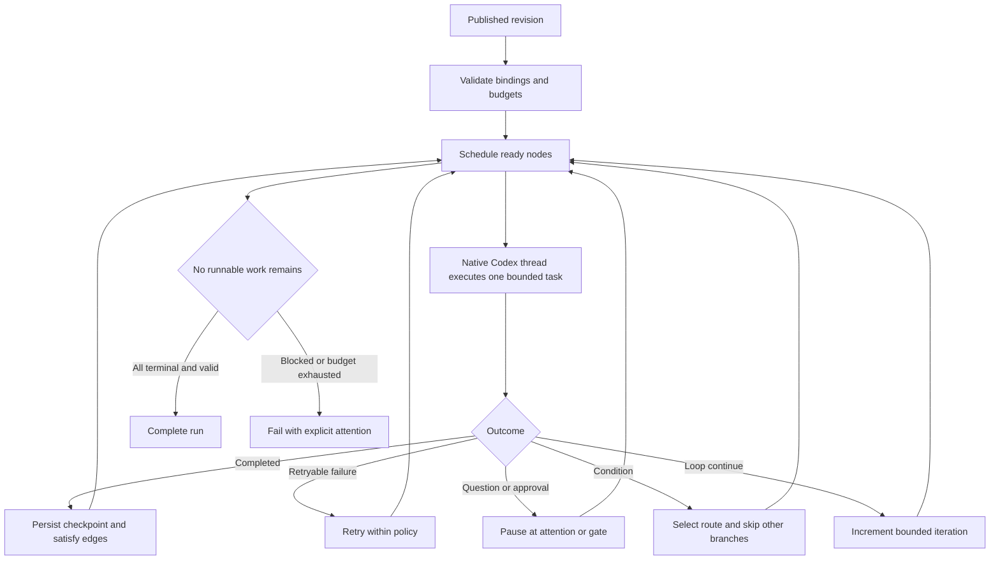

# Claude Code workflow parity

## Decision

Codex Loop can be the higher-level abstraction over the same *class* of workflow logic used by Claude Code. It should not try to clone Claude Code's private model/tool loop. The useful boundary is:

- Claude Code or Codex owns each agent's local perceive-reason-act tool loop.
- Loop owns the durable graph, dependencies, budgets, checkpoints, validation, capability bindings, human gates, and cross-session supervision.

That separation is portable across model runtimes and gives users one conversational control plane instead of requiring them to draw orchestration diagrams.

## What Claude Code exposes publicly

Anthropic describes the underlying agentic loop as consistent across terminal, desktop, IDE, web, Slack, and CI surfaces. Sessions persist messages and tool results, can be resumed or forked, and isolate context between sessions. Skills load reusable instructions on demand, while subagents run in separate contexts and return summaries. See [How Claude Code works](https://code.claude.com/docs/en/how-claude-code-works) and [Extend Claude Code](https://code.claude.com/docs/en/features-overview).

For multi-agent work, Claude Code exposes two orchestration forms. Subagents are focused workers reporting to the caller; experimental agent teams add a lead, independent teammates, a shared dependency-aware task list, and peer messaging. Anthropic explicitly notes the coordination and token overhead and recommends parallelism only for sufficiently independent work. See [Run agents in parallel](https://code.claude.com/docs/en/agents) and [Agent teams](https://code.claude.com/docs/en/agent-teams).

Hooks add deterministic lifecycle control around tool use, subagent completion, task creation/completion, idle states, and session events. Hooks can block, request approval, inject context, audit, or run model-based verification. MCP supplies external tools and authentication, and non-interactive/SDK execution supplies streaming events plus JSON-schema-constrained output. See [Hooks](https://code.claude.com/docs/en/hooks), [MCP](https://code.claude.com/docs/en/mcp), and [Programmatic execution](https://code.claude.com/docs/en/headless).

## Mapping to Codex Loop

| Claude Code primitive | Codex Loop abstraction | Current implementation |
| --- | --- | --- |
| One session's agentic tool loop | Agent/verify/condition worker node | Persistent native Codex app-server thread per node |
| Lead plus dependency-aware task list | Versioned directed graph and scheduler | Ready-node scheduling with parallelism and total-agent budgets |
| Subagent | Focused agent node | Independent node context; map nodes alone may request bounded subagents |
| Team plan approval / task completion hooks | Gate and verification nodes | Explicit operator decision and rubric-driven verification |
| Hook events | Runtime event projection and state transitions | Tool, approval, user-input, completion, failure, and retry events persisted |
| Skills | Reusable design/operation procedure | `design-loop` and `operate-loop` plugin skills |
| MCP tools and authenticated integrations | Capability binding | Discovery of skills, apps, MCP, Computer Use, shell, and verified CLI auth |
| Session resume/fork | Thread persistence and checkpoints | Native thread IDs persist; completed node results get revision/repository keyed checkpoints |
| JSON-schema output | Designer intermediate representation | 5.6-Sol returns a constrained complete proposal compiled to a workflow definition |
| Context isolation and summaries | Context Blocks and edge payloads | Nodes receive only readable blocks plus dependency outputs |

## The chat-first design loop

The skill asks at most three questions, and only when an answer changes safety, architecture, access, meaningful cost, external effects, or the definition of done. Otherwise the Designer records assumptions. It discovers capability/authentication state before choosing integrations. Existing authenticated GitHub CLI, MCP, app, or Computer Use access is bound by reference; missing access becomes a setup requirement. Tokens, passwords, keys, and secret values are neither requested nor persisted.

## The execution loop

This mirrors the observable control logic around Claude Code workflows: isolate work, unblock dependencies, project events, enforce deterministic gates, retry bounded failures, and synthesize only after prerequisites complete. The worker remains a full agent rather than a rigid function call.

## Important non-parity

Loop is not a byte-for-byte Claude Code team implementation. Today it does not provide peer-to-peer worker messaging, automatic per-node Git worktrees, hook configuration as a public user-authored language, or distributed queue/lease semantics. The graph and JSON store are local-first and single-process. Checkpoints currently reuse completed node results only when their definition and repository revision match; they are not a general artifact cache. Subworkflow support is intentionally bounded and needs broader production qualification before deeply nested graphs should be trusted.

Those are follow-on layers, not reasons to move graph construction back to the user. The graph is an inspectable execution plan and audit record; chat is the primary authoring interface.
